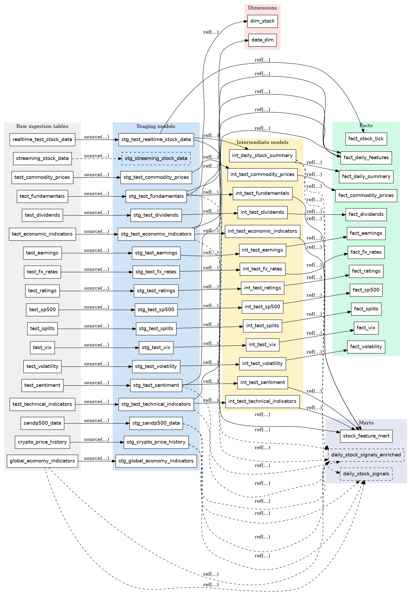

# DataBridge

## Project Overview

DataBridge is a comprehensive financial data platform designed to ingest, process, and analyze both real-time and static data sources. The project's primary goals are:

Many financial data workflows today separate batch and real-time processes, lack unified transformation logic, and require manual intervention. DataBridge provides an end-to-end, unified pipeline combining batch (Kaggle) and streaming (Alpha Vantage) ingestion, scalable Spark ETL, BigQuery storage, DBT transformations into a star schema, and workflow orchestration via Docker Compose and Airflow.

- One primary real-time data source from Alpha Vantage for intraday stock prices
- Automated ingestion of static datasets from Kaggle (e.g., S&P 500, global economy, cryptocurrency)
- Unified ETL processing using PySpark and for scalable data loading into BigQuery
- Kafka integration (producer & consumer) for streaming data pipelines
- Data modeling and transformations with DBT, resulting in a star schema (fact and dimension tables) in BigQuery
- Workflow orchestration using Apache Airflow
- Containerized local development and deployment via Docker Compose (Kafka, Python services)
- Comprehensive testing suite with pytest for pipeline validation

<p align="center">
  <a href="https://youtu.be/BXZvJIVycHE" target="_blank">
    
  </a>
  <br />
  <a href="https://youtu.be/BXZvJIVycHE" target="_blank"> -> Click to watch the demo video on YouTube</a>
</p>

## Prerequisites

- Python 3.12
- Java JRE (for Spark)
- Google Cloud account with BigQuery & GCS access
- Kaggle account for static pipelines
- Docker & Docker Compose (optional, for Kafka and containerized services)
- DBT Core & DBT BigQuery plugin (for data modeling)

## Installation

1. Clone the repository:
   ```bash
   git clone https://github.com/your-org/DataBridge.git
   cd DataBridge
   ```
2. Create and activate a Python virtual environment:
   ```bash
   python -m venv .venv
   source .venv/bin/activate
   ```
3. Install dependencies:
   ```bash
   pip install --upgrade pip
   pip install -r requirements.txt
   ```

## Configuration

1. Copy environment file templates:
   ```bash
   cp .env.example .env
   cp config/dbt-user-creds.example.json config/dbt-user-creds.json
   ```
2. Edit `.env` and fill in:
   - `ALPHA_VANTAGE_KEYS` (comma-separated API keys)
   - `PROJECT_ID` (your GCP project ID), `DATASET_NAME` (BigQuery dataset name), `GCS_BUCKET` (temporary GCS bucket)
   - `PARQUET_OUTPUT_PATH` (optional; GCS or local path to write Parquet exports)
   - `STOCK_SYMBOLS` (comma-separated tickers)
   - `KAGGLE_USERNAME`, `KAGGLE_KEY`
   - `KAFKA_BOOTSTRAP_SERVERS`, `KAFKA_TOPIC`, `KAFKA_CONSUMER_GROUP`
3. Populate `config/dbt-user-creds.json` with your GCP service account key.

## GCP Setup

Use the helper scripts to provision GCS bucket and BigQuery dataset:

```bash
python - <<EOF
from config.gcp_setup import create_gcs_bucket, create_bigquery_dataset
create_gcs_bucket("<your-gcs-bucket>")
create_bigquery_dataset("<your-dataset-name>")
EOF
```

## Pipelines

### Static Data Pipeline

Run all static pipelines (S&P 500, global economy, crypto, etc.):

```bash
python static/run_all.py
```

Or run individual modules, e.g.:

```bash
python static/sandp500.py
```

### Real-Time Pipeline

- **Last N records** (one-off):
  ```bash
  python streaming/realtime_stock_recent.py
  ```
- **Continuous stream** (every 5 minutes):
  ```bash
  python streaming/realtime_stock_stream.py
  ```

### Kafka Test Stream & Consumer

1. Produce test data to Kafka and write to BigQuery:
   ```bash
   python streaming/realtime_test_kafka_stream.py
   ```
2. Consume from Kafka and load to BigQuery:
   ```bash
   python kafka_consumer/consumer.py
   ```

### ETL Module

Use the Alpha Vantage ETL module in `etl/alpha_vantage.py`:

```python
from etl.alpha_vantage import fetch_intraday_data, parse_alpha_vantage_json, write_to_bigquery
# fetch, parse into Spark DataFrame, then write:
data = fetch_intraday_data("AAPL")
df = parse_alpha_vantage_json(data, "AAPL", spark)
write_to_bigquery(df, "intraday", DATASET_NAME, PROJECT_ID, GCS_BUCKET)
```

## DBT Models

DBT is used for transforming raw tables and modeling marts:

```bash
# Ensure your profile is set (profile: default picks up env vars)
dbt deps
dbt seed
dbt run
dbt test
```

Models live under `models/` with `staging/`, `intermediate/`, and `marts/`.



## Airflow (Optional)

DAG definitions reside in `airflow/dags/`. To run Airflow locally:

```bash
export AIRFLOW_HOME=$(pwd)/airflow
airflow db migrate
airflow standalone
```

## Docker & Docker Compose

Kafka & test-producer/consumer can be launched via Docker Compose:

```bash
docker-compose up -d
```

Services:

- `zookeeper`, `kafka`
- `test-producer` (runs Kafka test stream)
- `kafka-consumer` (loads Kafka topic to BigQuery)

## Running Tests

Run Python unit tests with `pytest`:

```bash
pytest
```

## Directory Structure

```
├── config/                  # configuration and GCP setup
├── etl/                     # Alpha Vantage ETL module
├── kafka_utils/             # Kafka producer config utility
├── kafka_consumer/          # Kafka consumer script
├── static/                  # static data pipelines (Kaggle)
├── streaming/               # real-time & test streaming scripts
├── models/                  # DBT models (staging, marts, etc.)
├── airflow/                 # Airflow DAGs & logs
├── tests/                   # unit tests
├── Dockerfile
├── docker-compose.yml
├── requirements.txt
└── README.md
```

## License

This project is licensed under the [MIT License](LICENSE).
